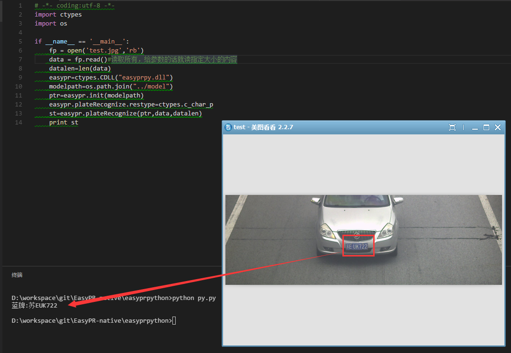

### 说明
+ 此项目是提供开源车牌识别系统[EasyPR][5]的java,scala,python,nodejs,go语言(windows和linux)调用的简单接口
+ EasyPR([github][5])([oschina][1])为此工程的子模块，没有做任何修改
+ [EasyPR-change](EasyPR-change)替换EasyPR中的对应同名的源代码文件，不然无法加载自己定义的路径的模型文件，源代码中有bug
+ [NativeEasyPR](NativeEasyPR)提供c++层的native代码,目前提供了jni和python的c++代码(nodejs除外)
+ [easyprpython](easyprpython)提供EasyPR的python接口，采用ctypes，使用的库是标准c语言导出的动态库接口
+ [easyprgo](easyprgo)提供EasyPR的go接口，使用的库是标准c语言导出的动态库接口，所以库与python使用的相同
    - winodws使用[syscall.NewLazyDLL][6]
    - linux使用[cgo][7]
+ [easyprnodejs](easyprnodejs)提供EasyPR的nodejs接口，由于node addon的特殊性，使用的解决方案是动态生成的，顾c++源码放到这个文件夹下，详情请访问此文件夹
+ [easyprjava](easyprjava)提供EasyPR的java接口
+ [easyprscala](easyprscala)提供EasyPR的scala接口
+ [easyprjavaweb](easyprjavaweb)提供EasyPR的javaweb接口以及页面展示
+ git clone代码之后记得git submodule update --init --recursive(初始化更新一下子模块,然后按照文档替换相关源文件)
+ 或者下载zip包之后去[EasyPR][5]下载最新代码，如果使用我编译好的dll(x64_vc12)，则无需下载和更新EasyPR

### 环境
#### 1.windows-vs2013
+ 用到的easypr源代码，均是通过vs解决方案里面手动添加相对路径源代码，然后替换我所提供的源代码；
+ 以前工作用过EasyPR，是用java调用，所以就开了此项目，这个后面加的node，python，golang调用均是后面换了工作之后所作的；
+ 问这个项目怎么用的时候，如果原EasyPR能在windows下跑成功，这个就是没问题的，opencv采用的3.1.0版本，具体请看[NativeEasyPR](NativeEasyPR)。

#### 2.linux-camke3.1.0+
+ 低于cmake3.1.0编译无法通过的，camke写法有变化；
+ 我在centos7 64位下测试，输出结果跟windows有差别，特别是编码这块，windows输出就是gbk编码，linux就变成utf-8了，应该是编译器的问题，以前老版本在ubuntu下测试时没问题的；
+ 还有中文某些情况下没有，比如车牌什么颜色不输出，只有车牌号，还有同样识别车牌的颜色，sobel，mser，识别结果有出入，不知道是我设置的问题，还是源码本身的问题，主要设置函数 pr->setDetectType() 在NativeEasyPR/src/process.cpp下请自行测试;
+ 如果有建议的建议给出，谢谢，具体请看[NativeEasyPR](NativeEasyPR)。

### 本项目地址
+ [github][2]
+ [coding][4]
+ [oschina][3]

### NativeEasyPR中easyprtest-c++测试效果如下

具体使用请参见[NativeEasyPR](NativeEasyPR)

### easyprjava EasyPRTest.java测试效果如下(scala类似)

具体使用请参见[easyprjava](easyprjava)或者[easyprscala](easyprscala)

### java-web展示效果图如下

具体使用请参见[easyprjavaweb](easyprjavaweb)

### easyprpython py.py测试效果如下

具体使用请参见[easyprpython](easyprpython)

### easyprgo easyprwin.go测试效果如下

具体使用请参见[easyprgo](easyprgo/src/easyprgo)

### easyprnodejs app.js测试效果如下

具体使用请参见[easyprnodejs](easyprnodejs)

[1]: https://git.oschina.net/easypr/EasyPR.git
[2]: https://github.com/smirkcat/EasyPR-native.git
[3]: https://git.oschina.net/smirkcat/EasyPR-native.git
[4]: https://git.coding.net/smirkcat/EasyPR-native.git
[5]: https://github.com/liuruoze/EasyPR.git
[6]: https://github.com/golang/go/wiki/WindowsDLLs 
[7]: https://github.com/golang/go/wiki/cgo