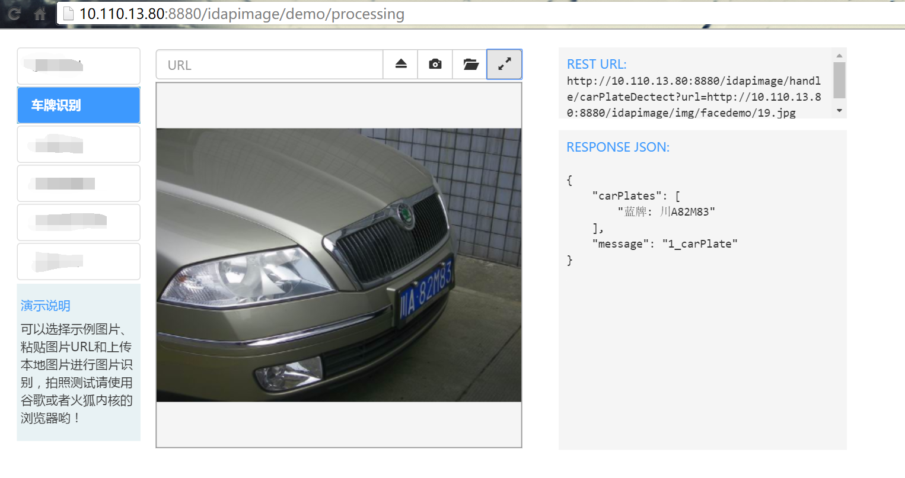

### 说明
+ 此项目是提供车牌识别的java接口，不做源码的任何修改，只在上面增加相关接口
+ [EasyPR][1]为此工程的子模块，没有做任何修改
+ [NativeEasyPR](NativeEasyPR)提供c++层的native代码,目前只提供jni
+ [easyprjava](easyprjava)提供EasyPR的java接口

### 目标效果图如下
此图是在去年10月份抓取的代码的演示图，于自己提供好的java接口，然后使用javaweb框架做成如下图所示的效果

[1]:https://git.oschina.net/easypr/EasyPR