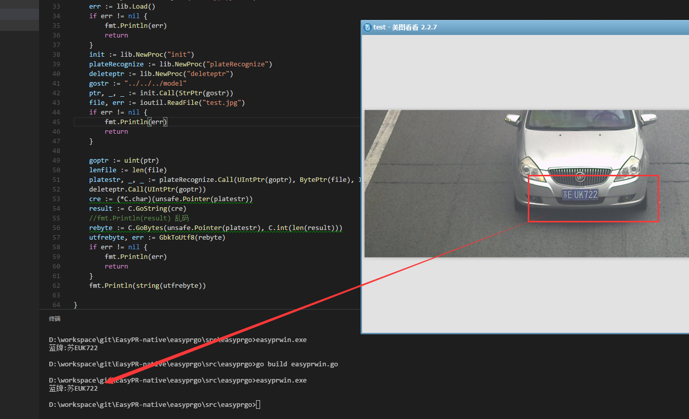

### 使用了go syscall方式调用

### 运行
#### windows
- 把NativeEasyPR 生成的库 easyprexport.dll 复制到当前目录
- 运行 
```
$ go build easyprwin.go
$ easyprwin.exe
```

#### linux 
- 暂无，考虑用cgo

得到结果 *蓝牌:苏EUK722*

### windows运行结构如下图
