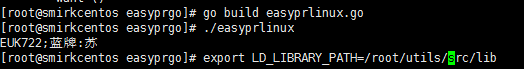

### 编译运行 因为工作语言关系，所以添加了cgo 
#### windows 使用syscall.NewLazyDLL 这个函数
- 把NativeEasyPR 生成的库 easyprexport.dll 复制到lib目录
- 运行 
```bash
$ go build main/main.go
$ easypr.exe
蓝牌:苏EUK722
```

#### linux  使用cgo
- 设置 环境变量LD_LIBRARY_PATH  export LD_LIBRARY_PATH=/root/utils/src/lib 这里为放置libeasyprexport.so的路径
- 运行
```bash
$ go build main/main.go
$ ./easypr
EUK722;蓝牌:苏  #为什么反过来求告知
```

得到结果 *蓝牌:苏EUK722*

### windows运行结果示意图


### linux运行结果示意图
