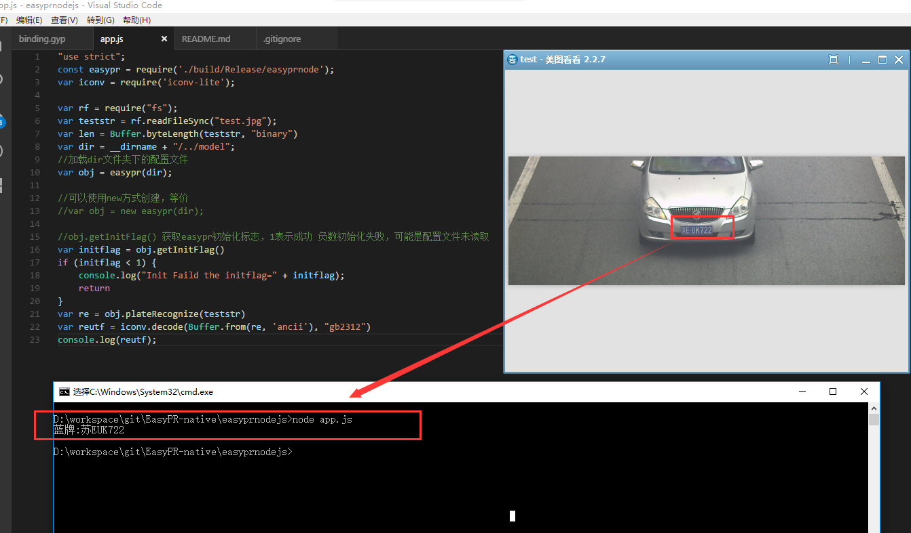

### 使用了node addon c++ object

### opencv环境变量设置（暂时只有windows_x64版本）
去官网下载opencv3.1.0之后，假设opencv根目录为xxx, 则需把xxx\build\x64\vc12\bin加进系统path环境变量下

### 编译环境准备
```
npm install node-gyp -g
npm install iconv-lite
```

### 运行
```
node app.js
```
得到结果 *蓝牌:苏EUK722*

### 运行结构如下图
