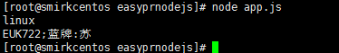

### 使用了node addon c++ object

### node环境安装
- 去官网下载node安装包，[下载地址](https://nodejs.org/en/download)
- 安装时需要选着npm

### 编译环境准备
```bash
$ npm install node-gyp -g
$ npm install iconv-lite
```

### 编译
- 编译前需要依赖NativeEasyPR的编译的包
- linux需要依赖pkg-config
- gyp file参考node-opencv编写
```shell
node-gyp configure # windows 生成可能是MTD 不是MD  
                   # 需要手动打开sln文件 修改对应的编译参数 目前gyp参数设置了没生效
node-gyp build # linux 可能出现/usr/bin/ld: cannot find -lippicv
               # 需要去 /usr/local/lib/pkgconfig/opencv.pc 删除-lippicv 这段字符即可
               # 或者 执行 sudo ln -s /usr/local/share/OpenCV/3rdparty/lib/libippicv.a /usr/local/lib/libippicv.a
```

### 运行
```bash
$ node app.js # 如果报Error: libopencv_shape.so.3.1: cannot open shared object file: No such file or directory 类似的错误
              # 请执行 export LD_LIBRARY_PATH=${LD_LIBRARY_PATH}:/usr/local/lib 这是因为没有找到运行库的原因
```
得到结果 *蓝牌:苏EUK722*

### windows运行结果示意图


### linux运行结果示意图
