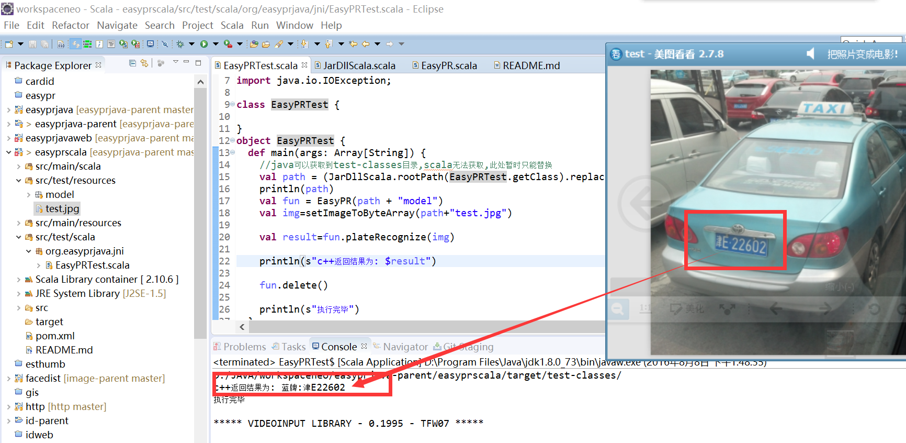

### 说明，与java接口类似，动态库一样
+ jni写法例子参考我的另外两个项目[ImgJni][1],[scalacpptest][2]
+ 加载动态库路径解决参考项目[loaddll][3]
+ 测试前请安装opencv3.1.0，配置方法见NativeEasyPR

#### windows
+ 把NativeEasyPR 生成的库 easyprjni.dll 复制到[src/main/resources/dll](src/main/resources/dll)目录下

#### linux 
+ 把NativeEasyPR 生成的库 easyprjni.dll 复制到[src/main/resources/dll](src/main/resources/dll)目录下，改名easyprjni.so

#### 运行
+ 此项目是maven工程项目，依赖junit,导入用最新版eclipse或者intellij-idea即可
+ scala配置环境，请参考项目[loaddll][3]
+ 测试请运行org.easypr.jni包下面的EasyPRTest类

### 运行结构如下图

[1]: https://git.oschina.net/smirkcat/ImgJni.git
[2]: https://git.oschina.net/smirkcat/scalacpptest.git
[3]: https://git.oschina.net/smirkcat/loaddll.git